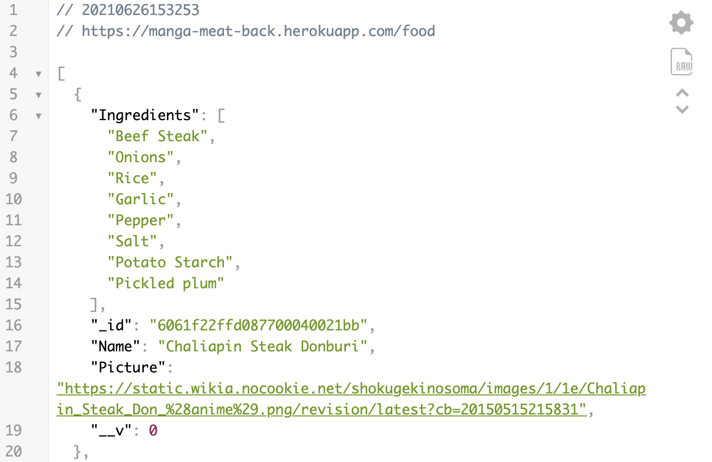

# Manga Meat Backend

Manga Meat uses a MongoDB Atlas API for the backend. Express is used to simplify the server creation process. This backend has full CRUD functionality using POST, GET, PUT, and DELETE requests. The backend is deployed using MongoDB Atlas and Heroku. Endpoints can be found in the readme.

### Endpoints

Food data can be found at the '/food' endpoint and chef data can be found at the '/character' endpoint.
